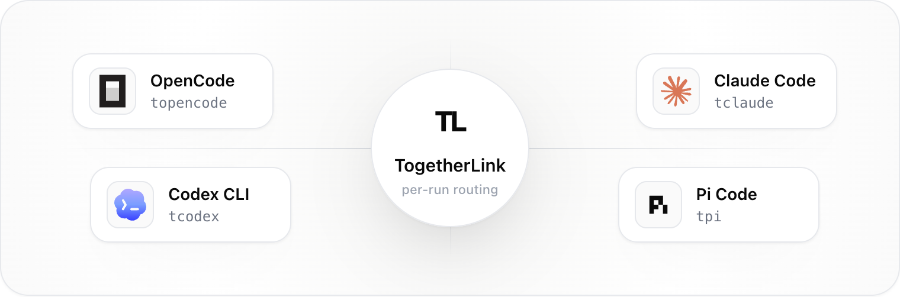

# togetherlink

[](https://github.com/Nutlope/togetherlink/actions/workflows/live-agent-gauntlet.yml)



Use [Together AI](https://togetherai.link/?utm_source=togetherlink&utm_medium=referral&utm_campaign=example-app) models from local coding-agent CLIs.

## For AI agents

An LLM-readable documentation file is published at <https://togetherlink.vercel.app/llms.txt>. If you are an AI agent asked to install, configure, or use togetherlink (including headless use), read that file first — it covers install, configure, every command, the available models, headless/agentic usage patterns, and how to keep the tool up to date.

## Install

One-liner — installs the `togetherlink`, `tclaude`, `topencode`, `tcodex`, `tgrok`, and `tpi` commands to `~/.togetherlink/bin/` and installs [Bun](https://bun.sh) for you if it isn't already present:

```bash
curl -fsSL https://togetherlink.vercel.app/install.sh | sh
```

Then run `togetherlink` and pick the coding tool you want to start:

```bash
togetherlink
```

Or launch a tool directly:

```bash
togetherlink codex        # alias: tcodex
togetherlink chatgpt      # alpha: ChatGPT Desktop session with restore (alias: codex-app)
togetherlink claude       # alias: tclaude
togetherlink grok         # alias: tgrok
togetherlink pi           # alias: tpi
togetherlink opencode     # alias: topencode
```

If no Together API key is configured yet, an interactive launch automatically runs `togetherlink configure` first. You can also run `togetherlink configure` directly, or set `TOGETHER_API_KEY`. The installed binary keeps itself up to date automatically from `togetherlink.vercel.app`.

If the underlying agent CLI is missing, togetherlink does not install it automatically. It prints the official install command and docs link for the selected tool, then exits.

The compact CLI guide is:

```text
togetherlink configure
togetherlink chatgpt [--model <model>] [--restore]  (alpha, alias: codex-app)
togetherlink codex [...]       (alias: tcodex)
togetherlink claude [...]      (alias: tclaude)
togetherlink grok [...]        (alias: tgrok)
togetherlink pi [...]          (alias: tpi)
togetherlink opencode [...]    (alias: topencode)
```

## Local Development

Install dependencies from the repo root:

```bash
pnpm install
```

Build the TypeScript CLI:

```bash
pnpm -F @togetherlink/cli build
```

Keep the CLI rebuilding while you edit:

```bash
pnpm dev
```

Leave that running in one terminal, then run `togetherlink` commands from another terminal.

Run the built CLI directly:

```bash
node packages/cli/dist/bin/togetherlink.js
node packages/cli/dist/bin/togetherlink.js help
```

Run through the workspace bin, which is closest to how users will invoke it:

```bash
pnpm -F @togetherlink/cli exec togetherlink
pnpm -F @togetherlink/cli exec togetherlink help
```

Testing commands and live smoke notes live in [TESTING.md](TESTING.md).

## Analytics

To disable TogetherLink's anonymous analytics, set:

```bash
export TOGETHERLINK_TELEMETRY_DISABLED=1
```

When set, TogetherLink does not create analytics install state or send requests to its telemetry endpoint.

## Author

- [Riccardo Giorato](https://github.com/riccardogiorato) ([X](https://x.com/riccardogiorato))
- [Hassan](https://github.com/Nutlope) ([X](https://x.com/nutlope))
