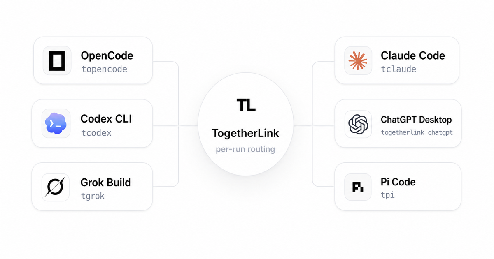

# togetherlink

[](https://github.com/Nutlope/togetherlink/actions/workflows/live-agent-gauntlet.yml)



Use [Together AI](https://togetherai.link/?utm_source=togetherlink&utm_medium=referral&utm_campaign=example-app) models from local coding-agent CLIs.

## For AI agents

An LLM-readable documentation file is published at <https://togetherlink.vercel.app/llms.txt>. If you are an AI agent asked to install, configure, or use togetherlink (including headless use), read that file first — it covers install, configure, every command, the available models, headless/agentic usage patterns, and how to keep the tool up to date.

## Install

One-liner — installs the `togetherlink`, `tclaude`, `topencode`, `tcodex`, `tdeepseek`, `tdroid`, `tgrok`, `thermes`, `tpi`, and `tprime` commands to `~/.togetherlink/bin/` and installs [Bun](https://bun.sh) for you if it isn't already present:

```bash
curl -fsSL https://togetherlink.vercel.app/install.sh | bash
```

Then run `togetherlink` and pick the coding tool you want to start:

```bash
togetherlink
```

Or launch a tool directly:

```bash
togetherlink codex        # alias: tcodex
togetherlink chatgpt      # alpha: ChatGPT Desktop session with restore (alias: codex-app)
togetherlink claude       # alias: tclaude
togetherlink deepseek     # alpha: DeepSeek Harness web UI (alias: tdeepseek)
togetherlink droid        # Factory login required once (alias: tdroid)
togetherlink grok         # alias: tgrok
togetherlink hermes       # alias: thermes
togetherlink hermes desktop
togetherlink pi           # alias: tpi
togetherlink prime        # alias: tprime
togetherlink opencode     # alias: topencode
```

To pin a model for one run, put the TogetherLink flag before the harness name:

```bash
togetherlink --model zai-org/GLM-5.2 claude -p "task"
togetherlink --model zai-org/GLM-5.2 codex exec "task"
```

Arguments after `claude`, `codex`, or another harness name belong to the underlying agent CLI, so
TogetherLink does not consume model flags placed there.

Hermes and Hermes Desktop receive a temporary standalone Together provider plugin for that launch. Existing Hermes sessions, skills, memories, plugins, and preferences remain available; TogetherLink does not persist the provider or replace the user's saved credentials.

Prime Agent receives a generated, credential-free Together provider extension activated only for the `tprime` launch. TogetherLink keeps that metadata under its own home so Prime's detached workers can recover, passes the API key as a runtime override, and leaves Prime's settings, skills, sessions, and `~/.prime/agent/models.json` untouched.

Factory Droid receives a generated, credential-free custom-model catalog activated only for the `tdroid` launch. TogetherLink preserves Droid's normal home and cached Factory login, sends model requests to Together, disables Factory cloud session sync for that launch, and does not edit `~/.factory/settings.json`. The official Droid CLI still requires a one-time Factory browser login (or `FACTORY_API_KEY` for headless use).

DeepSeek Harness support is alpha because upstream is still a developer preview. `tdeepseek` launches the official `dsh web` profile with a generated, credential-free `--patch` overlay and a runtime-only Together key. It does not rewrite `$DSH_HOME/cordis.patch.yml`, settings, credentials, or profiles.

If no Together API key is configured yet, an interactive launch automatically runs `togetherlink configure` first. You can also run `togetherlink configure` directly, or set `TOGETHER_API_KEY`. The installed binary keeps itself up to date automatically from `togetherlink.vercel.app`.

To route model requests through a compatible credential proxy, set `TOGETHER_BASE_URL` in the launcher environment. TogetherLink appends `/v1` when needed and uses `https://api.together.ai/v1` when it is unset:

```bash
export TOGETHER_API_KEY=phantom-key
export TOGETHER_BASE_URL=http://127.0.0.1:1234/together
togetherlink codex
```

`TOGETHER_BASE_URL` applies to every coding harness and is intentionally not loaded from repository `.env` files.

If DeepSeek Harness is missing, invoking or selecting it installs the official `@deepseek-ai/dsh` package and then continues the launch. No installation happens during startup, configuration, detection, or self-update. Other missing agent CLIs are not installed automatically; togetherlink prints their official install command and docs link, then exits.

To disable TogetherLink's anonymous analytics, set:

```bash
export TOGETHERLINK_TELEMETRY_DISABLED=1
```

When set, TogetherLink does not create analytics install state or send requests to its telemetry endpoint.

The compact CLI guide is:

```text
togetherlink configure
togetherlink chatgpt [--model <model>] [--restore]  (alpha, alias: codex-app)
togetherlink codex [...]       (alias: tcodex)
togetherlink claude [...]      (alias: tclaude)
togetherlink deepseek [...]    (alpha, alias: tdeepseek)
togetherlink droid [...]       (alias: tdroid; Factory login required)
togetherlink grok [...]        (alias: tgrok)
togetherlink hermes [...]      (alias: thermes)
togetherlink hermes desktop [...]
togetherlink pi [...]          (alias: tpi)
togetherlink prime [...]       (alias: tprime)
togetherlink opencode [...]    (alias: topencode)
```

## Local Development

Install dependencies from the repo root:

```bash
pnpm install
```

Build the TypeScript CLI:

```bash
pnpm -F @togetherlink/cli build
```

Keep the CLI rebuilding while you edit:

```bash
pnpm dev
```

Leave that running in one terminal, then run `togetherlink` commands from another terminal.

Run the built CLI directly:

```bash
node packages/cli/dist/bin/togetherlink.js
node packages/cli/dist/bin/togetherlink.js help
```

Run through the workspace bin, which is closest to how users will invoke it:

```bash
pnpm -F @togetherlink/cli exec togetherlink
pnpm -F @togetherlink/cli exec togetherlink help
```

Testing commands and live smoke notes live in [TESTING.md](TESTING.md).

## Author

- [Riccardo Giorato](https://github.com/riccardogiorato) ([X](https://x.com/riccardogiorato))
- [Hassan](https://github.com/Nutlope) ([X](https://x.com/nutlope))
