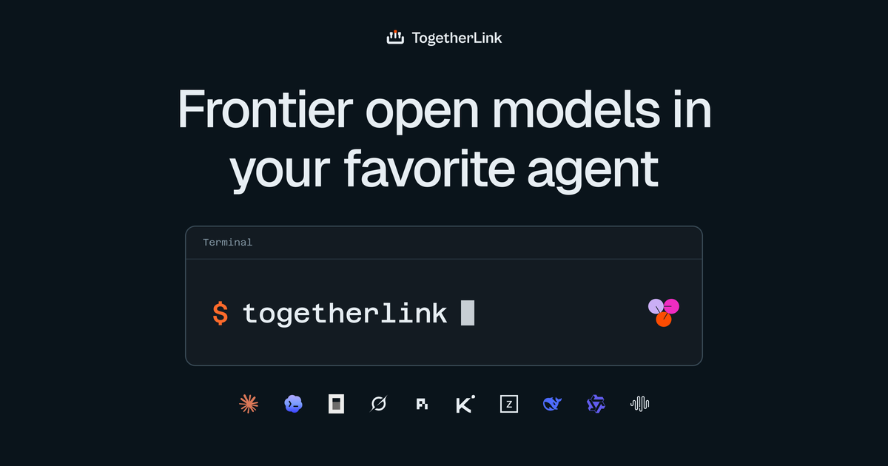

# Together Link



Frontier open models in the harness you already use.

[Together Link](https://link.together.ai/) connects Claude Code, Claude Desktop, Codex, ChatGPT Desktop, OpenCode, and Pi to open models on [Together AI](https://www.together.ai/). Your login, settings, memory, and history stay where they are. Each session prints its cost when you leave.

Product page: [link.together.ai](https://link.together.ai/). Docs: [docs.together.ai/docs/togetherlink](https://docs.together.ai/docs/togetherlink).

## Install

macOS or Linux, with Bash and curl. The coding agent or desktop app must already be installed.

```bash
curl -fsSL https://link.together.ai/install | bash
```

The installer adds `togetherlink` to `~/.local/bin` (and installs Bun if it is missing). Then save a Together API key:

```bash
togetherlink configure
```

Or export it for the current shell:

```bash
export TOGETHER_API_KEY="your_together_api_key"
```

Keys are read from `--api-key` (before the command), then `~/.togetherlink/config.json`, then `TOGETHER_API_KEY`. Project `.env` files are not loaded. `configure` can also store an optional Anthropic API key so Claude Code and Claude Desktop auto-routing can send hard requests to Claude Opus.

Open the launcher:

```bash
togetherlink
```

`tlink` is the same command. If a new terminal cannot find `togetherlink`, open a new shell or run `source ~/.zshrc` (Zsh) or `source ~/.bashrc` (Bash).

## Harnesses

Arguments after the tool name pass through to the agent.

| Command | Shortcut | What it launches |
| --- | --- | --- |
| `togetherlink claude` | `tclaude` | Claude Code |
| `togetherlink codex` | `tcodex` | Codex CLI |
| `togetherlink opencode` | `topencode` | OpenCode 2 |
| `togetherlink pi` | `tpi` | Pi Code 0.80.8+ (`togetherlink picode` also works) |
| `togetherlink claude-desktop` | `tclaude-desktop` | Claude Desktop, Cowork, and Code (beta, macOS and Linux) |
| `togetherlink chatgpt` | | ChatGPT Desktop (beta, macOS and Linux). `chatgpt-desktop` is an alias |

Examples:

```bash
togetherlink claude
togetherlink codex exec "Explain this project"
togetherlink opencode run "Explain this repository"
togetherlink pi
togetherlink claude -p "hello"
```

Terminal agents get a temporary config for that launch only. Claude Desktop and ChatGPT Desktop use a separate Together Link profile, so you can switch back:

```bash
togetherlink claude-desktop off
togetherlink chatgpt off
```

Remove those profiles (asks for confirmation; `--yes` skips the prompt):

```bash
togetherlink claude-desktop reset
togetherlink chatgpt reset --yes
```

Headless Claude Code needs stdin closed, or the process waits forever:

```bash
togetherlink claude -p "<TASK>" --output-format json < /dev/null
```

## Models

Auto is the default. List the live lineup, context, and prices:

```bash
togetherlink models
```

Pin one model for a single launch with `--main` **before** the tool name:

```bash
togetherlink --main zai-org/GLM-5.3 claude
togetherlink --main MiniMaxAI/MiniMax-M3 opencode
```

Shortcuts such as `tclaude` put the tool name first, so they cannot take `--main`. Together Link rejects Claude's `--model` flag. Use `--main` before the tool name, or leave it off to stay on Auto.

Current lineup (`togetherlink models` on v0.9.75):

| Model | Model ID | Claude `/model` tier |
| --- | --- | --- |
| Auto (default) | `auto` | Routes per request |
| Kimi K3 | `moonshotai/Kimi-K3` | Opus |
| GLM 5.3 | `zai-org/GLM-5.3` | Fable |
| DeepSeek V4.1 Flash | `deepseek-ai/DeepSeek-V4.1-Flash` | Sonnet |
| MiniMax M3 | `MiniMaxAI/MiniMax-M3` | Haiku |
| Qwen 3.8 | `Qwen/Qwen3.8-2.4T-A95B` | |

Codex, OpenCode, Pi, and ChatGPT Desktop stay on Together models. Claude Code and Claude Desktop do too, unless an Anthropic API key is configured for auto routing. Prices: run `togetherlink models`, or see [Together AI pricing](https://www.together.ai/pricing).

## Usage, images, and updates

```bash
togetherlink usage --last 7d
togetherlink update
togetherlink --version
```

Each session prints a cost receipt on exit. Claude Code, Claude Desktop, and ChatGPT Desktop can also generate images in the session. From the CLI:

```bash
togetherlink image generate --prompt "a red circle on a white background" --out logo.png
togetherlink image edit --image logo.png --prompt "make the circle blue"
```

Image options: `--quality auto|draft|standard|best`, `--seed`, `--out`, `--force`, `--json`.

## Help and feedback

This repository is Together Link's public support tracker. If the CLI does not install, update, or launch correctly, [open an issue](https://github.com/Nutlope/togetherlink/issues/new) with your operating system, the command you ran, and the complete error message.

Please do not include API keys or other credentials in an issue.

## Authors

- [Riccardo Giorato](https://github.com/riccardogiorato)
- [Hassan El Mghari](https://github.com/Nutlope)
